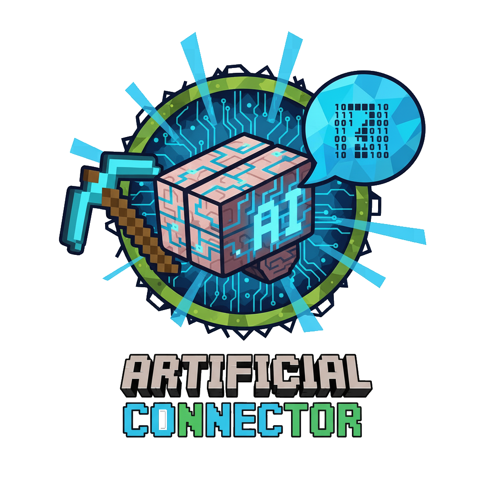

  

# Artificial Connector: Your Bridge to AI in Minecraft!

Ever wished you could bring the power of modern AI into your Minecraft world? The **Artificial Connector** mod makes it possible! This mod introduces a sophisticated machine, the **Connector Block**, that acts as a direct interface to external generative AI models, opening up a universe of new possibilities for interaction and automation.

Built for **NeoForge on Minecraft 1.21.1**, this mod is designed to be both powerful and user-friendly.

---

## ✨ Core Features

*   **The Connector Block:** The heart of the mod. This machine is your gateway to the AI. It provides clear visual feedback on its status:
    *   **Idle:** Ready to receive a prompt.
    *   **Processing:** Actively communicating with the AI, featuring a cool animated texture!
    *   **Success:** The AI has successfully processed your request.
    *   **Failed:** Something went wrong. Check your connection or configuration.
*   **New World Resources:** To build this advanced technology, you'll need to find and mine the new **Artificial Ore**, which can be smelted into ingots and other components.
*   **Secure, Client-Side Configuration:** Your API keys are your own. Configure your preferred AI model and API key safely in a local config file. Your private information is never shared with the server.

---

## 🚀 How to Get Started

1.  Explore the world and mine for **Artificial Ore**.
2.  Smelt the ore into **Artificial Ingots**.
3.  Craft your very first **Connector Block**.
4.  Open the client config file (`config/artificialconnector-client.toml`) and enter your API key.
5.  Place the block and start experimenting!

---

**Can I use this in my modpack?**

Absolutely! Feel free to include the Artificial Connector mod in your modpack. A link back to this CurseForge page is always appreciated!